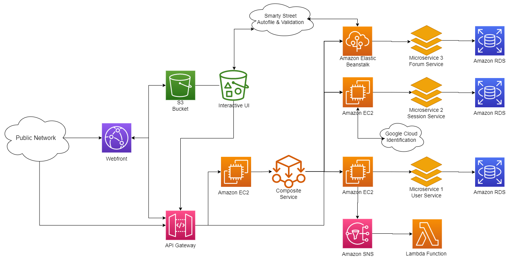

# 6156-CUMC-Badminton-Service
This is the introduction repository of the [E6156 Cloud Computing](https://donald-f-ferguson.github.io/Topics-in-SW-Engineering-F22/) course final project: CUMC Badminton Service Application.

Group member: [Yiru Gong](https://github.com/YiruGONG), [Zheyan Liu](https://github.com/zheyanliu99), [Brian Lee](https://github.com/beeleeballin), [Zhuolun Huang](https://github.com/ZhuolunHuang), [Youyuan Kong](https://github.com/Keviant)

## Project Overview

The entire project introduction: 

* Slides: [CUMC Badminton Service](./intro/CUMC Badminton Services.pdf)
* Youtube: [Demo](https://youtu.be/KFq0ex0oiKk)

## Architecture

## Service Github Repos

* Microservice S1: [CUMC-Badminton-Services-MS1](https://github.com/ZhuolunHuang/CUMC-Badminton-Services-MS1.git)
* Microservice 2: [CUMC-Badminton-Services-MS2](https://github.com/zheyanliu99/CUMC-Badminton-Services-MS2.git)
* Microservice 3: [E6156-Microservice3-Yiru-Brian](https://github.com/YiruGONG/E6156-Microservice3-Yiru-Brian.git)
* Composite serive 1: [UMC-Badminton-Services-CS1](https://github.com/zheyanliu99/CUMC-Badminton-Services-CS1.git)
* Web Application: [CUMC-Badminton-Services-Web-app](https://github.com/zheyanliu99/CUMC-Badminton-Services-Web-app.git)

